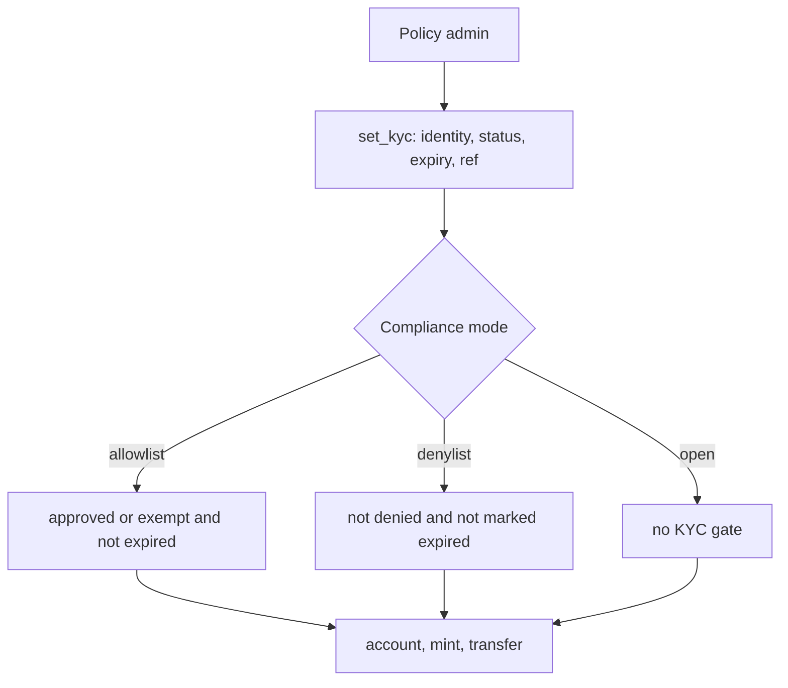
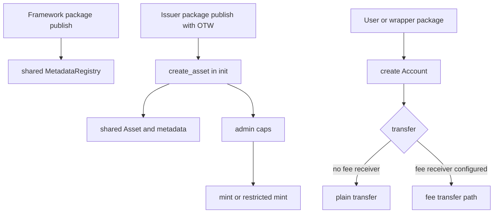

# Regulated Account

`regulated_account` is a framework package. Issuers do not mint an instance by
calling a factory from an existing coin type. Instead, each issuer publishes a
small Move package with its own one-time witness type, then calls
`regulated_account::regulated_account::create_asset` from that package's `init`.

A Sui-native regulated account framework for the same design space as ERC-1400,
ERC-3643, and Token-2022, without privacy extensions or a global KYC singleton.

Deployment status: this package is not deployed on Sui mainnet. The checked-in
Move lockfile is pinned for testnet development and review only.

This is similar to Sui Coin deployment because it uses a one-time witness, but it
does not create `Coin<T>`, `Currency<T>`, or `TreasuryCap<T>` objects. The
framework package creates one shared package-level `MetadataRegistry` when it is
published. Each issuer package creates a shared `Asset<T>`, a shared canonical
`AssetMetadata<Receipt<T>>` metadata entry, and issuer/admin capabilities for
regulated ledger operations. Issuers and holders then create shared per-holder
`Account<T>` objects through the account creation entrypoints.

## Flow Diagrams

### Admin KYC Policy Flow



`expires_ms` is evaluated in allowlist mode. In denylist mode, expiry timestamps
are not evaluated; use `KYC_DENIED` or `KYC_EXPIRED` status to block an identity.

### User / Package Deployer Flow



The fee path is required whenever a fee receiver is configured, even if a
bps-only fee would round to zero.

## Minimal Issuer Package

```move
module issuer::my_asset;

use regulated_account::regulated_account as ra;
use regulated_account::asset;

public struct MY_ASSET has drop {}

fun init(witness: MY_ASSET, ctx: &mut TxContext) {
    ra::create_asset(
        witness,
        b"MYASSET".to_string(),
        b"My Asset".to_string(),
        b"My regulated account asset.".to_string(),
        b"https://example.com/icon.png".to_string(),
        0,
        option::some(1_000_000),
        asset::allowlist_mode(),
        true,
        ctx.sender(),
        ctx,
    );
}
```

Publish the issuer package:

```bash
sui client publish --gas-budget 100000000
```

The framework package publish creates:

- one shared package-level `MetadataRegistry`.

Each issuer package publish creates one of each:

- shared `Asset<MY_ASSET>`;
- shared `AssetMetadata<Receipt<MY_ASSET>>`;
- `MintCap<MY_ASSET>`;
- `FreezeCap<MY_ASSET>`;
- `BurnCap<MY_ASSET>`;
- `ClawbackCap<MY_ASSET>`;
- `PolicyCap<MY_ASSET>`;
- `RegistrationCap<MY_ASSET>`;
- `FeeCap<MY_ASSET>`;
- `MetadataCap<Receipt<MY_ASSET>>`;
- `PauseCap<MY_ASSET>`;
- `CloseMintCap<MY_ASSET>`.

The caps are transferred to the `admin` address passed to `create_asset`.

## After Publish

- Create shared `Account<T>` objects for holders.
- In allowlist mode, approve identities with `set_kyc` before minting or
  receiving.
- On-chain KYC stores status, expiry, and `external_ref_hash`; keep rich
  compliance data off-chain or in typed extensions.
- `mode_mutable` allows allowlist, denylist, and open mode changes until
  `lock_compliance_mode`.
- Balances live in shared `Account<T>` objects, not transferable `Coin<T>`.
- If this standard is adopted, wallets and indexers should use `Receipt<T>` plus
  `AssetMetadata<Receipt<T>>` for discovery.
- `Receipt<T>` carries no balance; it is intended as a signal to display the
  holder's regulated account balance.
- Register metadata with `metadata::register<T>` and the shared registry.
- Holder actions use `HolderAuthority<T>` from owner authority or an authorized
  package witness.
- Package authority can move only its package-held account, not user accounts.
- Time-sensitive paths use `Time`: `no_time()` fails closed, and
  `clock_time(&clock)` evaluates KYC expiry and locks.
- Restricted lots are capped at 128 active lots and coalesced by unlock time and
  reference hash.
- Transfers enforce KYC, freeze, pause, shareholder caps, restricted lots, memo
  rules, minimum positive balance, and fees.
- `supply` is canonical `u64`; display helpers return `Option<u64>`; metadata
  fields are bounded.
- `min_positive_balance` blocks dust, permits full exit to zero, and can only
  increase when no identities have positive balances.
- Fee config requires fee transfer paths while a fee receiver is configured.
- Use sender or recipient fee paths when the fee receiver is also the sender or
  recipient account.
- Wrapper deposits and unwraps use normal transfers plus package authority.
- In allowlist mode, wrapper package identities must be approved before receiving.
- Admin policy changes use `reason_hash`; clawback and admin burn also use
  `Time`.
- Pause blocks public transfer, mint, burn, and account creation; admin recovery
  and policy controls remain available.
- Typed extensions bind to core objects with `asset::id` and `account::id`.
