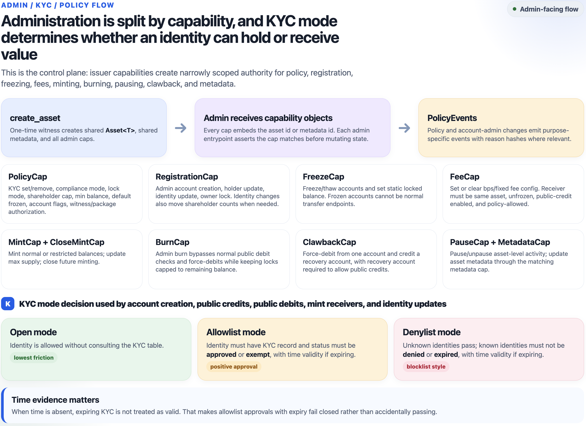
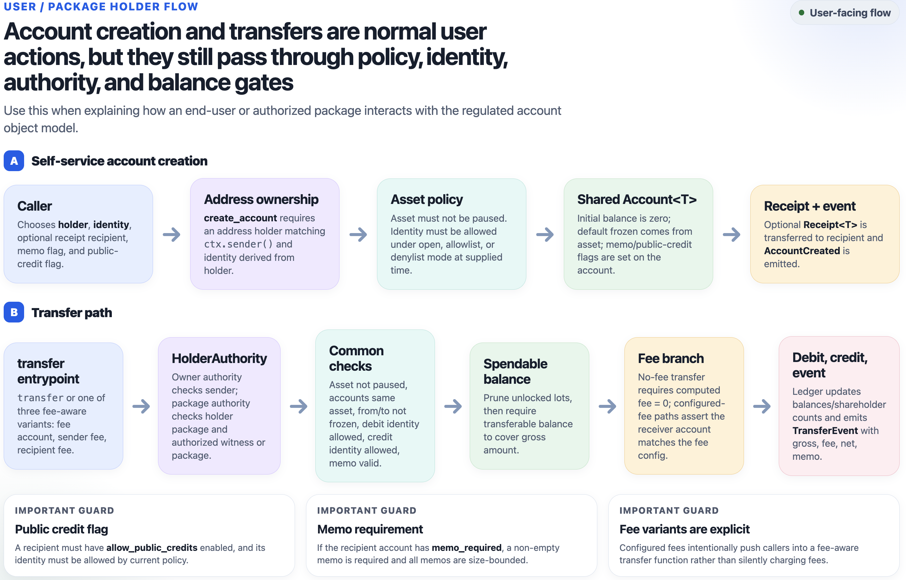

# Regulated Account Standard

`regulated_account` is a framework package. Issuers do not mint an instance by
calling a factory from an existing coin type. Instead, each issuer publishes a
small Move package with its own one-time witness type, then calls
`regulated_account::regulated_account::create_asset` from that package's `init`.

This is similar to Sui Coin deployment because it uses a one-time witness, but it
does not create `Coin<T>`, `Currency<T>`, or `TreasuryCap<T>` objects. It creates
a shared package-level `MetadataRegistry`, a shared `Asset<T>`, a shared
canonical `AssetMetadata<Receipt<T>>` metadata entry, shared per-holder
`Account<T>` objects, and issuer/admin capabilities for regulated ledger
operations.

## Flow Diagrams

### Admin KYC Policy Flow



### User / Package Deployer Flow



## Minimal Issuer Package

```move
module issuer::my_asset;

use regulated_account::regulated_account as ra;
use regulated_account::asset;

public struct MY_ASSET has drop {}

fun init(witness: MY_ASSET, ctx: &mut TxContext) {
    ra::create_asset(
        witness,
        b"MYASSET".to_string(),
        b"My Asset".to_string(),
        b"My regulated account asset.".to_string(),
        b"https://example.com/icon.png".to_string(),
        0,
        option::some(1_000_000),
        asset::allowlist_mode(),
        true,
        ctx.sender(),
        ctx,
    );
}
```

Publish the issuer package:

```bash
sui client publish --gas-budget 100000000
```

The publish transaction creates:

- one shared package-level `MetadataRegistry` when the regulated-account package
  itself is published;
- one shared `Asset<MY_ASSET>`;
- one shared `AssetMetadata<Receipt<MY_ASSET>>`;
- `MintCap<MY_ASSET>`;
- `FreezeCap<MY_ASSET>`;
- `BurnCap<MY_ASSET>`;
- `ClawbackCap<MY_ASSET>`;
- `PolicyCap<MY_ASSET>`;
- `RegistrationCap<MY_ASSET>`;
- `FeeCap<MY_ASSET>`;
- `MetadataCap<Receipt<MY_ASSET>>`;
- `PauseCap<MY_ASSET>`;
- `CloseMintCap<MY_ASSET>`.

The caps are transferred to the `admin` address passed to `create_asset`.

## After Publish

The issuer or users create `Account<T>` objects for holders. In allowlist mode,
the issuer first approves identities with `set_kyc`, then mints into approved
accounts.

`set_kyc` records eligibility status, expiry, and an optional external reference
hash. Issuer-specific attributes such as jurisdiction, investor class, and tax
residency belong off-chain behind that hash or in typed extension objects.

If `mode_mutable` is set at creation, the issuer can switch between allowlist,
denylist, and open mode until calling `lock_compliance_mode`, which permanently
freezes the compliance mode.

The important distinction from Coin is:

- Coin: users hold transferable `Coin<T>` objects.
- Regulated Account: balances live in shared `Account<T>` objects controlled by
  holder authority plus issuer/regulator caps.

Metadata follows the same typed-discovery idea as Sui Currency. Wallets discover
an owned `Receipt<T>` object, then read the shared `AssetMetadata<Receipt<T>>`
object for symbol, name, description, icon URL, and decimals. `Asset<T>` carries
policy and supply state, not branding.
After an issuer package publish, anyone can call `metadata::register<T>` with the
shared `MetadataRegistry` and `AssetMetadata<Receipt<T>>`; the registry then maps
`receipt_type<T>()` to the canonical metadata object ID.

Holder-controlled operations consume a hot-potato `HolderAuthority<T>` value:

- `authority::owner_authority<T>(ctx)` authorizes an address-held account when the
  transaction sender matches the account holder.
- `authority::package_authority<T, W>(witness)` authorizes a package-held account when
  the account holder is the witness package and the issuer has authorized either
  that witness type or the package address.

Package authority is intentionally narrow: it lets wrappers, vaults, or DvP
modules move only their own package-held account. It does not let a package move
user accounts.

Operations that can depend on expiring KYC or time-locked balances also consume
a hot-potato `Time` value:

- `authority::no_time()` fails closed for expiring KYC and treats restricted lots as
  locked.
- `authority::clock_time(&clock)` evaluates KYC expiry and locks against Sui's clock.
  Restricted mints that provide clock time reject already-unlocked lots and
  prune stale unlocked lots before checking lot capacity.

Each account stores at most 128 active restricted lots. Lots with the same
unlock timestamp and external reference hash are coalesced, which keeps
transferable-balance and lot-insertion scans bounded while supporting common
vesting and lockup schedules.

Generic transfer hooks are intentionally not part of core. The canonical
transfer path enforces built-in policy directly: KYC mode, freeze state, pause,
shareholder caps, restricted lots, memo requirements, minimum positive balance,
and configured fees.

`supply` reports the canonical u64 balance supply. Display-balance helpers
return `Option<u64>` so wallets/indexers can handle display-scale overflow
without aborting. Metadata strings are bounded in core: 16-byte symbol,
64-byte name, 512-byte description, and 256-byte icon URL.

Issuers can set a `min_positive_balance` to prevent dust accounts. A holder can
always exit to zero, but any non-zero balance must meet the configured minimum.

Transfer fees are configured with `set_fee_config`, which takes the receiver
`Account<T>` by reference and validates that it belongs to the asset, is not
frozen, and can receive public credits at the supplied `Time`. Use
`clear_fee_config` to disable fees. Plain `transfer` is only available when no
fee receiver is configured; once fees are configured, callers must use a
fee-bearing transfer path even if a bps-only fee would round to zero. Most fee
transfers use `transfer_with_fee_account`; if the configured fee receiver is
also the sender or recipient, use `transfer_with_sender_fee_account` or
`transfer_with_recipient_fee_account` because Move cannot pass one shared object
as multiple mutable account references. Dedicated fee-account credits are exempt
from `min_positive_balance`, while recipient-fee transfers enforce the
recipient's final positive balance as a normal account credit.

Wrapper integrations use normal transfers. A user deposits by signing a transfer
from their address account to the wrapper's package-held account. Unwrap is the
reverse: the wrapper burns its wrapped coin, then uses package authority to move
regulated balance from its own account back to the user. In allowlist mode the
issuer must KYC/approve the wrapper identity before it can receive credits.

Administrative freeze/thaw, clawback, admin burn, and issuer policy changes take
a bounded `reason_hash` for auditability. Store detailed legal or operations
records off-chain and put the digest/reference hash on-chain.
Clawback is an admin recovery power: it can credit a non-frozen destination that
allows public credits even when that destination would fail normal transfer KYC.

Pause blocks public balance-changing flows: transfer, mint, public burn, and
public account creation. Admin burn, clawback, fee changes, and policy changes
remain available so operators can respond during incidents.

Typed extensions should be separate objects, for example `BondTerms<T>` or
`EscrowTerms<T>`, and should bind to the core asset/account with
`asset::id(&asset)` and `account::id(&account)`.

## Abort Codes

Abort codes are scoped by the aborting module. The same numeric code can appear
in more than one module, so off-chain clients should interpret both module and
code.

| Module | Code | Constant | Meaning |
| --- | ---: | --- | --- |
| `regulated_account` | 1 | `EBadWitness` | Asset creation witness is not the one-time witness. |
| `asset` | 2 | `EInvalidMode` | Compliance mode is not allowlist, denylist, or open. |
| `asset` | 7 | `EIdentityNotAllowed` | Identity does not satisfy the active compliance mode. |
| `asset` | 11 | `EPolicyImmutable` | Compliance mode has been locked. |
| `asset` | 12 | `EMintClosed` | Minting has been permanently closed. |
| `asset` | 17 | `EInvalidDisplayScale` | Display-scale numerator or denominator is invalid. |
| `asset` | 18 | `EAssetPaused` | Paused asset blocked transfer, mint, public burn, or public account creation. |
| `asset` | 22 | `EMaxSupplyExceeded` | Supply would exceed the configured maximum. |
| `account` | 3 | `EAssetMismatch` | Account does not belong to the asset. |
| `account` | 5 | `ENotAuthorized` | Account creation holder/identity does not match sender. |
| `account` | 6 | `EAccountFrozen` | Operation requires an unfrozen account. |
| `account` | 8 | `EInsufficientBalance` | Balance or transferable balance is insufficient. |
| `account` | 14 | `EImmutableOwner` | Account owner has been locked. |
| `account` | 24 | `ELockedBalanceExceeded` | Static lock exceeds account balance. |
| `account` | 25 | `ERestrictedLotLimit` | Account has reached the restricted-lot cap. |
| `amount_math` | 25 | `EAmountOverflow` | Checked amount arithmetic overflowed. |
| `amount_math` | 28 | `EInvalidDisplayScale` | Display scale is zero-denominator or zero-numerator. |
| `caps` | 4 | `ECapAssetMismatch` | Capability does not belong to the asset. |
| `compliance` | 5 | `ENotAuthorized` | Holder authority is not authorized for the account. |
| `compliance` | 13 | `EPublicCreditDisabled` | Destination account does not allow public credits. |
| `fees` | 9 | `EInvalidFee` | Fee configuration or fee arithmetic is invalid. |
| `fees` | 15 | `EFeeReceiverRequired` | Fee receiver is missing or mismatched. |
| `fees` | 28 | `EFeeTooSmall` | Percent fee rounds to zero for a non-zero transfer. |
| `keys` | 3 | `EInvalidHolderKind` | Holder key kind is invalid. |
| `keys` | 4 | `EInvalidIdentityKind` | Identity key kind is invalid. |
| `kyc` | 26 | `EInvalidKycStatus` | KYC status is unknown to the package. |
| `ledger` | 13 | `EPublicCreditDisabled` | Clawback destination does not allow public credits. |
| `ledger` | 32 | `EInvalidRestrictedLot` | Restricted mint unlock time is invalid. |
| `metadata` | 4 | `ECapAssetMismatch` | Metadata capability does not match metadata object. |
| `metadata` | 29 | `EMetadataAlreadyRegistered` | Receipt type already has registered metadata. |
| `metadata` | 30 | `EMetadataNotRegistered` | Receipt type has no registered metadata. |
| `shareholders` | 23 | `EShareholderCapExceeded` | Positive-balance identity cap would be exceeded. |
| `shareholders` | 31 | `EMinPositiveBalance` | Non-zero balance is below the configured minimum. |
| `transfer` | 15 | `EFeeReceiverRequired` | Fee receiver account is required or mismatched. |
| `transfer` | 16 | `EUseTransferWithFee` | Plain transfer was used while a fee is configured. |
| `validation` | 10 | `EMemoRequired` | Destination requires a non-empty memo. |
| `validation` | 27 | `EInvalidVectorSize` | Metadata, memo, or reference hash exceeds its bound. |

## Package Layout

- `regulated_account.move`: minimal issuer/user-facing facade for asset/account
  creation only.
- `asset.move`: canonical `Asset<T>` state, KYC table, and asset policy fields.
- `account.move`: canonical `Account<T>` state, holder/identity fields,
  balances, locks, and restricted lots.
- `caps.move`: issuer/admin capability types.
- `authority.move`: `HolderAuthority<T>` and `Time` hot-potato types.
- `metadata.move`: `MetadataRegistry` and `AssetMetadata<Receipt<T>>`.
- `receipt.move`: wallet-discovery `Receipt<T>`.
- `ledger.move`: mint, burn, clawback, and balance accounting.
- `transfer.move`: direct and fee-bearing transfer execution paths.
- `compliance.move`: KYC, authorization, freeze/thaw, pause, and account policy
  administration.
- `kyc.move`: KYC record schema and status/time validity checks.
- `shareholders.move`: shareholder counters and minimum-positive-balance
  invariants.
- `fees.move`: transfer fee configuration and arithmetic.
- `keys.move`: canonical `HolderKey` and `IdentityKey` types plus constructors.
- `events.move`: canonical lifecycle, transfer, ledger, and metadata events.
- `policy_events.move`: canonical policy, compliance, and shareholder events.
- `amount_math.move`: checked integer/display-scale helpers.

Tests are split by behavior under `tests/`:

- `lifecycle_tests.move`: mint, burn, supply, display-scale, and zero-amount paths.
- `metadata_tests.move`: metadata updates and registry indexing.
- `compliance_tests.move`: KYC, freeze/thaw, pause, and policy controls.
- `shareholder_tests.move`: shareholder caps and minimum-positive-balance rules.
- `fee_tests.move`: fee configuration, fee transfer paths, and fee arithmetic.
- `restriction_tests.move`: static locks, restricted lots, clawback, and recovery.
- `wrapper_tests.move`: package authority, wrapper flows, and typed extensions.

Use `regulated_account::regulated_account as ra` for bootstrap creation calls.
Use the domain modules directly for operations and views, for example
`ledger::mint`, `transfer::transfer`, `compliance::set_kyc`, `asset::id`,
and `account::id`.
