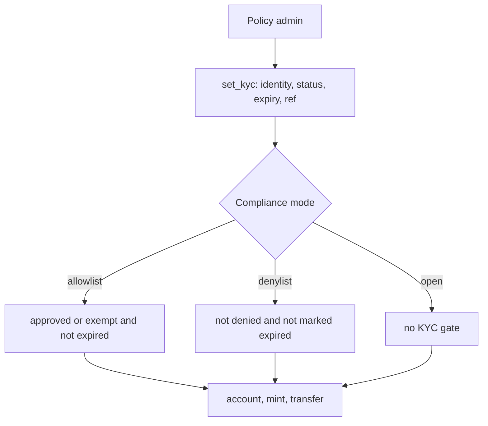
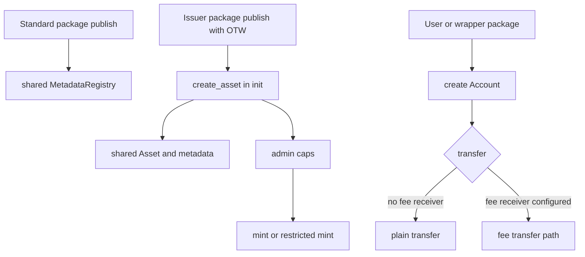

# Regulated Account Standard

`regulated_account` is a framework package. Issuers do not mint an instance by
calling a factory from an existing coin type. Instead, each issuer publishes a
small Move package with its own one-time witness type, then calls
`regulated_account::regulated_account::create_asset` from that package's `init`.

This is similar to Sui Coin deployment because it uses a one-time witness, but it
does not create `Coin<T>`, `Currency<T>`, or `TreasuryCap<T>` objects. The
framework package creates one shared package-level `MetadataRegistry` when it is
published. Each issuer package creates a shared `Asset<T>`, a shared canonical
`AssetMetadata<Receipt<T>>` metadata entry, and issuer/admin capabilities for
regulated ledger operations. Issuers and holders then create shared per-holder
`Account<T>` objects through the account creation entrypoints.

## Flow Diagrams

### Admin KYC Policy Flow



`expires_ms` is evaluated in allowlist mode. In denylist mode, expiry timestamps
are not evaluated; use `KYC_DENIED` or `KYC_EXPIRED` status to block an identity.

### User / Package Deployer Flow



The fee path is required whenever a fee receiver is configured, even if a
bps-only fee would round to zero.

## Minimal Issuer Package

```move
module issuer::my_asset;

use regulated_account::regulated_account as ra;
use regulated_account::asset;

public struct MY_ASSET has drop {}

fun init(witness: MY_ASSET, ctx: &mut TxContext) {
    ra::create_asset(
        witness,
        b"MYASSET".to_string(),
        b"My Asset".to_string(),
        b"My regulated account asset.".to_string(),
        b"https://example.com/icon.png".to_string(),
        0,
        option::some(1_000_000),
        asset::allowlist_mode(),
        true,
        ctx.sender(),
        ctx,
    );
}
```

Publish the issuer package:

```bash
sui client publish --gas-budget 100000000
```

The standard package publish creates:

- one shared package-level `MetadataRegistry`.

Each issuer package publish creates one of each:

- shared `Asset<MY_ASSET>`;
- shared `AssetMetadata<Receipt<MY_ASSET>>`;
- `MintCap<MY_ASSET>`;
- `FreezeCap<MY_ASSET>`;
- `BurnCap<MY_ASSET>`;
- `ClawbackCap<MY_ASSET>`;
- `PolicyCap<MY_ASSET>`;
- `RegistrationCap<MY_ASSET>`;
- `FeeCap<MY_ASSET>`;
- `MetadataCap<Receipt<MY_ASSET>>`;
- `PauseCap<MY_ASSET>`;
- `CloseMintCap<MY_ASSET>`.

The caps are transferred to the `admin` address passed to `create_asset`.

## After Publish

The issuer or users create `Account<T>` objects for holders. In allowlist mode,
the issuer first approves identities with `set_kyc`, then mints into approved
accounts.

`set_kyc` records eligibility status, expiry, and an optional external reference
hash. Issuer-specific attributes such as jurisdiction, investor class, and tax
residency belong off-chain behind that hash or in typed extension objects.

If `mode_mutable` is set at creation, the issuer can switch between allowlist,
denylist, and open mode until calling `lock_compliance_mode`, which permanently
freezes the compliance mode.

The important distinction from Coin is:

- Coin: users hold transferable `Coin<T>` objects.
- Regulated Account: balances live in shared `Account<T>` objects controlled by
  holder authority plus issuer/regulator caps.

Metadata follows the same typed-discovery idea as Sui Currency. Wallets discover
an owned `Receipt<T>` object, then read the shared `AssetMetadata<Receipt<T>>`
object for symbol, name, description, icon URL, and decimals. `Asset<T>` carries
policy and supply state, not branding.
After an issuer package publish, anyone can call `metadata::register<T>` with the
shared `MetadataRegistry` and `AssetMetadata<Receipt<T>>`; the registry then maps
`receipt_type<T>()` to the canonical metadata object ID.

Holder-controlled operations consume a hot-potato `HolderAuthority<T>` value:

- `authority::owner_authority<T>(ctx)` authorizes an address-held account when the
  transaction sender matches the account holder.
- `authority::package_authority<T, W>(witness)` authorizes a package-held account when
  the account holder is the witness package and the issuer has authorized that
  exact witness type.

Package authority is intentionally narrow: it lets wrappers, vaults, or DvP
modules move only their own package-held account. It does not let a package move
user accounts. Wrapper packages should keep the authorized witness as an internal
capability and should not expose public functions that return it.

Operations that can depend on expiring KYC or time-locked balances also consume
a hot-potato `Time` value:

- `authority::no_time()` fails closed for expiring KYC and treats restricted lots as
  locked.
- `authority::clock_time(&clock)` evaluates KYC expiry and locks against Sui's clock.
  Restricted mints that provide clock time reject already-unlocked lots and
  prune stale unlocked lots before checking lot capacity.
  Admin burn and clawback also require clock time when the debited account has
  restricted lots, so stale unlocked lots are pruned before any lock trimming.

Each account stores at most 128 active restricted lots. Lots with the same
unlock timestamp and external reference hash are coalesced, which keeps
transferable-balance and lot-insertion scans bounded while supporting common
vesting and lockup schedules.

Generic transfer hooks are intentionally not part of core. The canonical
transfer path enforces built-in policy directly: KYC mode, freeze state, pause,
shareholder caps, restricted lots, memo requirements, minimum positive balance,
and configured fees.

`supply` reports the canonical u64 balance supply. Display-balance helpers
return `Option<u64>` so wallets/indexers can handle display-scale overflow
without aborting. Metadata strings are bounded in core: 16-byte symbol,
64-byte name, 512-byte description, and 256-byte icon URL.

Issuers can set a `min_positive_balance` to prevent dust accounts. A holder can
always exit to zero, but any non-zero balance must meet the configured minimum.
The minimum can be lowered at any time, but increases are only allowed while
there are no positive-balance identities; otherwise issuers must first migrate or
exit affected accounts.

Transfer fees are configured with `set_fee_config`, which takes the receiver
`Account<T>` by reference and validates that it belongs to the asset, is not
frozen, and can receive public credits at the supplied `Time`. Use
`clear_fee_config` to disable fees. Plain `transfer` is only available when no
fee receiver is configured; once fees are configured, callers must use a
fee-bearing transfer path even if a bps-only fee would round to zero. Most fee
transfers use `transfer_with_fee_account`; if the configured fee receiver is
also the sender or recipient, use `transfer_with_sender_fee_account` or
`transfer_with_recipient_fee_account` because Move cannot pass one shared object
as multiple mutable account references. Dedicated fee-account credits are exempt
from `min_positive_balance`, while recipient-fee transfers enforce the
recipient's final positive balance as a normal account credit.

Wrapper integrations use normal transfers. A user deposits by signing a transfer
from their address account to the wrapper's package-held account. Unwrap is the
reverse: the wrapper burns its wrapped coin, then uses package authority to move
regulated balance from its own account back to the user. In allowlist mode the
issuer must KYC/approve the wrapper identity before it can receive credits.

Administrative freeze/thaw and issuer policy changes take a bounded `reason_hash`
for auditability. Clawback and admin burn take both `Time` and `reason_hash`:
the time value is used to prune unlocked restricted lots before forced debits,
and the reason hash ties the action to off-chain legal or operations records.
Clawback is an admin recovery power: it can credit a non-frozen destination that
allows public credits even when that destination would fail normal transfer KYC.

Pause blocks public balance-changing flows: transfer, mint, public burn, and
public account creation. Admin burn, clawback, fee changes, and policy changes
remain available so operators can respond during incidents.

Typed extensions should be separate objects, for example `BondTerms<T>` or
`EscrowTerms<T>`, and should bind to the core asset/account with
`asset::id(&asset)` and `account::id(&account)`.
