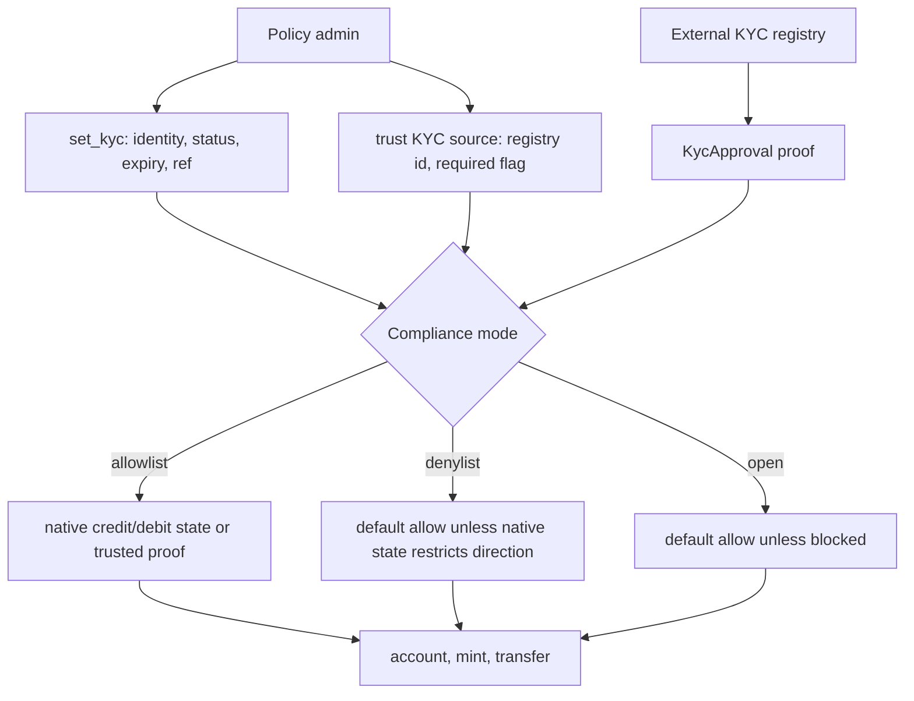
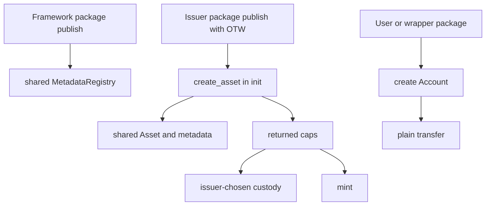

# Regulated Account

`regulated_account` is a framework package. Issuers do not mint an instance by
calling a factory from an existing coin type. Instead, each issuer publishes a
small Move package with its own one-time witness type, then calls
`regulated_account::regulated_account::create_asset` from that package's `init`.

A Sui-native regulated account framework for the same design space as ERC-1400,
ERC-3643, and Token-2022, without privacy extensions or a global KYC singleton.

Deployment status: this package is not deployed on Sui mainnet. The checked-in
Move lockfile is pinned for testnet development and review only.

This is similar to Sui Coin deployment because it uses a one-time witness, but it
does not create `Coin<T>`, `Currency<T>`, or `TreasuryCap<T>` objects. The
framework package creates one shared package-level `MetadataRegistry` when it is
published. Each issuer package creates a shared `Asset<T>`, a shared canonical
`AssetMetadata<Receipt<T>>` metadata entry, and issuer capabilities for
regulated ledger operations. The issuer package decides how those capabilities
are transferred, split across roles, or wrapped by governance. Issuers and
holders then create shared per-holder `Account<T>` objects through the account
creation entrypoints.

Balances live in shared `Account<T>` objects. KYC is keyed by `IdentityKey`, not
by the account object itself. For a normal address-held account,
`keys::identity_address(addr)` is the required address identity; package-held
accounts can use external identity keys for wrapper, custody, or off-chain legal
identity models.

On-chain KYC is asset-specific eligibility metadata, not a personal KYC
database. Detailed records should stay off-chain behind `external_ref_hash`, or
in separate typed extension objects when an issuer needs on-chain extensions.

## Flow Diagrams

### Admin KYC Policy Flow



Native KYC records are directional. Effective status is computed with
`expires_ms`; after a nonzero expiry is passed, or no clock is provided for an
expiring record, the record is treated as `KYC_EXPIRED`.

| Status | Credit / receive / mint | Debit / transfer out / public burn |
| --- | --- | --- |
| `KYC_APPROVED` | yes | yes |
| `KYC_EXEMPT` | yes | yes |
| `KYC_PENDING` before expiry | yes | no |
| `KYC_PENDING` after expiry | no | no |
| `KYC_DIVEST_ONLY` | no | yes |
| `KYC_DENIED` | no | no |
| `KYC_EXPIRED` | no | no |

If an identity has no native KYC record, or its native status is `KYC_UNKNOWN`,
allowlist mode requires a trusted external approval while denylist and open
modes default-allow. Required external KYC sources are enforced in every
compliance mode, including open mode.

### User / Package Deployer Flow



## Minimal Issuer Package

```move
module issuer::my_asset;

use regulated_account::regulated_account as ra;
use regulated_account::asset;

public struct MY_ASSET has drop {}

fun init(witness: MY_ASSET, ctx: &mut TxContext) {
    let (
        mint_cap,
        freeze_cap,
        burn_cap,
        clawback_cap,
        policy_cap,
        registration_cap,
        metadata_cap,
        pause_cap,
        close_mint_cap,
    ) = ra::create_asset(
        witness,
        b"MYASSET".to_string(),
        b"My Asset".to_string(),
        b"My regulated account asset.".to_string(),
        b"https://example.com/icon.png".to_string(),
        0,
        option::some(1_000_000),
        asset::allowlist_mode(),
        true,
        vector[],
        ctx,
    );

    transfer::public_transfer(mint_cap, ctx.sender());
    transfer::public_transfer(freeze_cap, ctx.sender());
    transfer::public_transfer(burn_cap, ctx.sender());
    transfer::public_transfer(clawback_cap, ctx.sender());
    transfer::public_transfer(policy_cap, ctx.sender());
    transfer::public_transfer(registration_cap, ctx.sender());
    transfer::public_transfer(metadata_cap, ctx.sender());
    transfer::public_transfer(pause_cap, ctx.sender());
    transfer::public_transfer(close_mint_cap, ctx.sender());
}
```

Publish the issuer package:

```bash
sui client publish --gas-budget 100000000
```

The framework package publish creates:

- one shared package-level `MetadataRegistry`.

Each issuer package publish creates one of each:

- shared `Asset<MY_ASSET>`;
- shared `AssetMetadata<Receipt<MY_ASSET>>`;
- `MintCap<MY_ASSET>`;
- `FreezeCap<MY_ASSET>`;
- `BurnCap<MY_ASSET>`;
- `ClawbackCap<MY_ASSET>`;
- `PolicyCap<MY_ASSET>`;
- `RegistrationCap<MY_ASSET>`;
- `MetadataCap<Receipt<MY_ASSET>>`;
- `PauseCap<MY_ASSET>`;
- `CloseMintCap<MY_ASSET>`.

`create_asset` returns the caps to the issuer package's `init`. The issuer
package must then transfer, split, wrap, or otherwise store them. This matches
Sui's issuer-controlled cap custody pattern instead of forcing one framework
admin address.

## After Publish

- Create shared `Account<T>` objects for holders.
- In allowlist mode, approve identities with `set_kyc` before full two-way
  operation. `KYC_PENDING` identities can receive before expiry but cannot debit;
  `KYC_DIVEST_ONLY` identities can debit but cannot receive.
- Optional shared KYC registries can issue live `KycApproval<T>` proofs.
- Registry operators create `KycRegistry<R>` with their own one-time witness and
  manage it with `KycRegistryCap<R>`.
- Destroy `KycRegistryCap<R>` to renounce registry administration.
- Accepted KYC registries can be configured at `create_asset` time with
  `KycSourceConfig` values.
- `PolicyCap<T>` can later trust or untrust KYC source instances for that asset.
- Each asset can trust up to 128 KYC sources, with up to 32 required sources.
- A trusted external source can satisfy allowlist KYC; a required source must
  provide a valid proof even when native KYC is approved.
- Native asset KYC remains authoritative when present: `KYC_DENIED` and
  `KYC_EXPIRED` block both directions, `KYC_PENDING` is credit-only before
  expiry, and `KYC_DIVEST_ONLY` is debit-only.
- KYC-sensitive calls take up to 128 `KycApproval<T>` values; local-only flows
  pass `vector[]`.
- On-chain KYC stores only asset-specific eligibility status, expiry, and
  `external_ref_hash`; keep rich compliance data off-chain or in typed
  extensions.
- `mode_mutable` allows allowlist, denylist, and open mode changes until
  `lock_compliance_mode`.
- Balances live in shared `Account<T>` objects, not transferable `Coin<T>`.
- If this standard is adopted, wallets and indexers should use `Receipt<T>` plus
  `AssetMetadata<Receipt<T>>` for discovery.
- `Receipt<T>` carries no balance; it is intended as a signal to display the
  holder's regulated account balance.
- Register metadata with `metadata::register<T>`, the shared registry, and the
  asset's `MetadataCap<Receipt<T>>`.
- Holder actions use `HolderAuthority<T>` from owner authority or an authorized
  package witness.
- Package authority can move only its package-held account, not user accounts.
- Time-sensitive KYC paths use `Time`: `no_time()` fails closed, and
  `clock_time(&clock)` evaluates KYC and proof expiry.
- Freeze is identity-level for operation checks and account creation: freezing an
  account also freezes its identity until thawed.
- Transfers enforce KYC, freeze, pause, shareholder caps, and memo rules.
- Balances are stored directly on shared `Account<T>` objects as a `u64`
  balance field. They are not stored in an asset-level table or dynamic field.
- `supply` is canonical `u64`; `MetadataCap<Receipt<T>>` can update display
  decimals; metadata fields are bounded.
- Positive-balance account counts are tracked by identity only for shareholder
  caps; they are not the balance source of truth.
- `transfer::close_account` lets a holder transfer the full remaining balance to
  another approved account and delete the source account in one call.
- `transfer::close_empty_account` deletes an already-empty account.
- Wrapper deposits and unwraps use normal transfers plus package authority.
- In allowlist mode, wrapper package identities must be approved before receiving.
- Vesting, lockups, and escrow schedules should live in typed extension packages
  or vaults with their own `Account<T>`, not in the core account object.
- Vault releases use normal transfers to pre-approved recipient accounts.
- Clawback enforces recipient credit KYC.
- Admin policy changes, clawback, and admin burn use `reason_hash`. Clawback also
  accepts `Time` and `KycApproval<T>` proofs for the recipient credit check.
- Pause blocks public transfer, mint, burn, and account creation; admin recovery
  and policy controls remain available.
- Typed extensions bind to core objects with `asset::id` and `account::id`.
